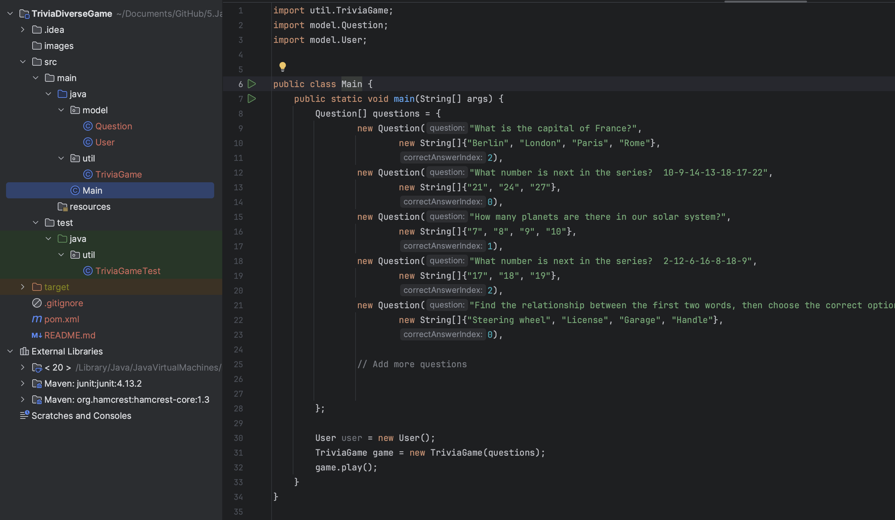

# Trivia Game

A simple console-based trivia game written in Java. This project implements a trivia game that allows the user to answer questions and receive a score based on correct answers.

## Features

- User input for personalizing the gaming experience with their name.
- Provides a set of questions with answer options.
- Calculates and displays the user's score at the end of the game.

## 📝 Installation

- Clone or download this repository to your computer.
- Make sure you have Java installed on your system.
- Open the project in your preferred Java IDE.
- Run the Main class to start the game.

## 📚 Technologies | Frameworks | Tools
- Java programming language
- IntelliJ tool

## ⏯️ How to Play

- At the beginning of the game, input your name when prompted.
- Answer the game's questions by typing the corresponding number of your choice.
- At the end of the game, you will see your obtained score.

## 🧪 Testing

This project includes unit tests to ensure the reliability and correctness of the code. Tests are written using JUnit, a popular testing framework for Java applications.

To run the tests locally, follow these steps:

1. Open the project in your preferred Java IDE.
2. Navigate to the test directory.
3. Run the test classes using the IDE's integrated test runner or using Maven.
